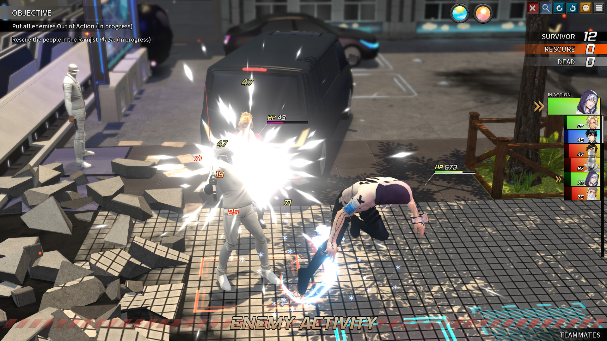
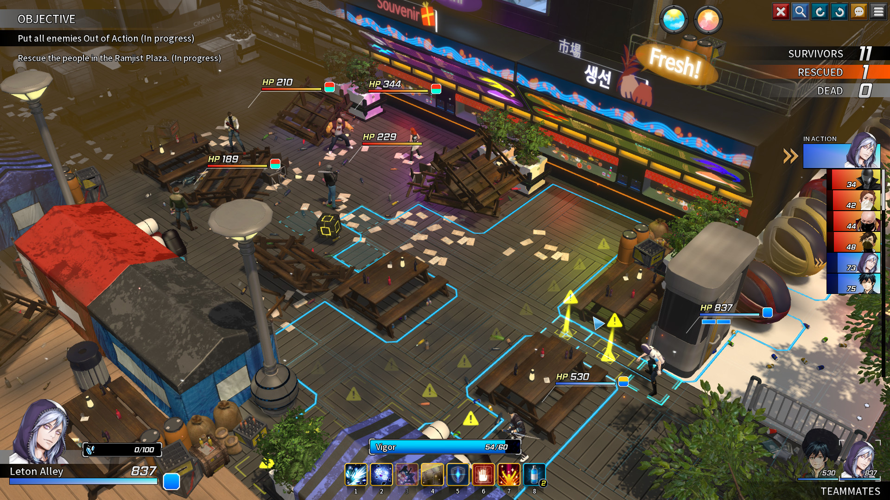

前段时间玩了一个游戏叫[***TROUBLESHOOTER: Abandoned Children（中文名：纷争终结者: 被遗弃的孩子们）***](https://store.steampowered.com/app/470310/_/) 。由一个韩国小工作室开发，体量并不算很大，但就游戏效果来说，已经足够合格了，且与未来想要制作的游戏具有众多可取之处，以本文记录之。

简单地总结地说，这是一款二次元的XCOM2（虽然本人也是先玩了本作再去体验了XCOM2手动滑稽），但刚上手体验XCOM2的时候，确实能感受到战斗系统的相似性（~~不能说一模一样只能说完全一致~~）

### 游戏截图

### 战斗系统
#### 关卡设计
##### 地图
总的来说，本作的关卡是由一个又一个互不联系的场景组成。而每个场景则是由全3D模型构建的，与一般3D游戏不同的是，可以明显地看出模型的排布是按照格子的，整个游戏世界也是网格化的，举个通俗的例子 *Minecraft* 便是一个典型，模型都可以放进类似 `1*1*1` 或者 `2*1*1`
的空间内，然后像搭积木般便可构建出自己的地图。

这样做的好处有很多：
- 对于非大型团队来说，统一规格的模型处理起来要方便的多，地图构建也容易的多
- 对于一个策略游戏来说，战旗游戏走格子应该是非常容易接受的一件事
- 对于玩家来说网格化的地图会非常有条理，且容易操作
- 从编程角度来考虑，如此设计也有利于编码的实现

因此我决定沿用这种方式，来尽快地构建出我的游戏。

##### 音乐
这实在不是我的强项（~~听个响就好~~），略去不表，当前目标：能做到 ***风格主题与剧情相统一就是胜利*** 。

##### 敌人
从关卡设计的角度来看敌人设计的话，敌人设计或许更可以看做难度设计。在一个大背景是养成因素的游戏中，到底是 ***动态难度***（指关卡的难度会随着养成的进度而发生变化），还是 ***固定难度*** ，对游戏开发者来说是一个非常困难的抉择，前者会让玩家心生怨气，”养成都养到了敌人身上“，如此言论在采用动态难度的游戏的论坛版块里并不少见；后者则会显得平平淡淡，不够生动，真实性和游戏性总是会产生冲突，而如何平衡则是每一个游戏制作者需要思考的。

>有一类隐藏机制相比之下更加多样化且普遍——调整游戏难度和平衡的机制。这些机制被总称为动态难度调节（dynamic difficulty adjustment,下文简称DDA）。
>
>DDA是电子游戏根据玩家水平调整游戏难度的过程。若玩家表现优秀，游戏将加大难度和挑战。相反，若玩家打得很吃力，游戏可能会降低难度帮玩家度过难关。
>
>DDA分为短期和长期两种。短期DDA与游戏的随机数生成器挂钩，目的是为了防止玩家遇到极端情况，一直幸运或一直倒霉。这些随机系统在某些时刻对游戏进行平衡，一般不会对游戏进程造成长远影响。
>
>而长期DDA是根据玩家的水平调整游戏的整体难度。由于每位玩家的技能水平不同，统一的难度等级或选项无法覆盖所有玩家的需求。长期DDA的目标是使游戏对每位玩家来说既具有挑战性，又可克服。
> 
> —— [More Than Meets the Eye: The Secrets of Dynamic Difficulty Adjustment (gamedeveloper.com)](https://www.gamedeveloper.com/design/more-than-meets-the-eye-the-secrets-of-dynamic-difficulty-adjustment)

本作的敌人设置或者说难度曲线整体比较平稳，有时战斗会出现额外的buff会有惊喜感，却又不像侠隐阁那般频繁，以至于让人厌恶~~（苦修三年，还是什么都改变不了，全程看BUFF）~~。

###### 关于难度曲线的一些思考
对于一个传统策略RPG来说，评价玩家的实力我们可以将它简单的建个模，
玩家的实力 = 