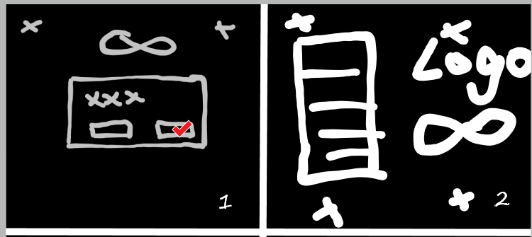

# 十页说明书
---
## 游戏名称
### 名称
Infinity:∞
### 游戏系统
PC/Android/IOS
### 目标玩家年龄
14+
### 预计 ESRB 定级
T（青少年）：此级别通常会包含暴力、暗示性主题、粗鲁的幽默、极少的血腥或者极少的粗话。
### 计划发行日期
∞
### 游戏标志

<!--more-->

---
## 游戏总览
### 故事梗概
你，作为一个整天除了上网冲浪、跟群友聊天吹水之外就无所事事的路人甲，在某天冲浪的时候，屏幕上突然弹出了一个窗口，“想明白生命的意义吗？想真正的……活着吗？“ ~~2202年了还有人记得无限恐怖呢~~，点下了确认按钮的你，竟离奇地出现在了一个神秘的空间之中。与你有着类似遭遇的还有数人，在一位自称是”导师“的神秘人物的带领下，体验了一回身临其境版的《生化危机》。在险象环生的剧情中，居然需要完成各种指定的任务，而失败了就会面临被”抹杀“的风险……（仅 demo 部分）

### 流程概述
《Infinity:∞》是一个第三人称视角下的策略角色扮演游戏（SRPG,Strategy Role-Playing Game），玩家需要在游戏中扮演一位路人甲，被神秘的力量传送到了未知的空间，然后被迫完成一个又一个艰难的任务......

在此期间，玩家需要凭借自身的策略以及对剧情的熟悉，来尽可能地在剧情世界中存活下去，完成任务后，玩家就会被传送回 ***主神空间*** ，修复一切伤势，并根据任务完成的情况，获得剧情等级和剧情点数。通过消耗剧情等级和剧情点数，在主神空间处强化自身或兑换道具，以面对越来越危险的世界和越来越困难的任务。

---
## 玩家角色
- 姓名：可自定义
- 年龄：【18-30】自定义
- 寿命：【60-80】随机
- 性别：可自定义
- 初始角色属性：可自定义
- 初始血统：人族
- 职业：可自定义，影响初始技能等级，和初始携带物品
- 操作：WASD 移动，鼠标控制画面移动，Q / E 旋转视角

---
## 游戏可玩性
鉴于是独立开发，技术积累有限，本作的游戏类型预定为策略角色扮演，策略在于战斗系统采用类似战棋的回合制，游戏中玩家体验玩到以下要素：
- 掩体机制：玩家根据场地上的物品，获得对远程攻击的闪避几率，如果闪避成功，则敌方攻击改为对掩体造成伤害，所有的物体都是可破坏的。

- 生存因素：玩家在剧情世界完成任务的过程中，可能需要经历好几天的时长，期间要尽力保证自己生存下去，甚至搭建一个临时的营地，可能遇到的挑战有很多，比如：
    - 水、食物、药品的缺乏（某些剧情世界）
    - 来自未知敌人的袭击
    - 一直在流逝的时间，以及越来越危险的世界和敌人

- 剧情：随着玩家选择不同而走向不同的剧情，如何使自己获利最大化是一门技术。通过引发额外的剧情，获得更高的奖励，来强化自身，面对未来更严峻的挑战。

- NPC：通常他们都有着自己的性格特点以及剧情，甚至同为“轮回者”的玩家也能存档读档（？），期望用更加先进的 AI 技术来仿真 NPC 的一切活动。

- 解密：有时候，玩家可能会遇到一些小小的谜题，甚至是来自剧情世界观的限制，~~无法力大砖飞~~需要破解世界观，找到真正的真相，才能完成任务。

- 真实的时间和故事进程：剧情世界的确有着自己的剧本，随着时间的流逝，事情节点会按部就班地发生，玩家需要争分夺秒地去改变抑或是参与到这即将发生的一切。

- 难度设置：采用 [动态难度](https://blog.79v2r.ml/2022/05/03/%E5%9C%A8TroubleShooter%E6%B8%B8%E7%8E%A9%E8%BF%87%E7%A8%8B%E4%B8%AD%E7%9A%84%E4%B8%80%E4%BA%9B%E9%9A%8F%E7%AC%94/#%E5%85%B3%E4%BA%8E%E9%9A%BE%E5%BA%A6%E6%9B%B2%E7%BA%BF%E7%9A%84%E4%B8%80%E4%BA%9B%E6%80%9D%E8%80%83) ，依据玩家的表现动态调节游戏的难度，使得所有水平的玩家都能感受到适当的压迫感。

- 存档设置：默认通过教程（第一个世界）之后才会开放存档功能。存档分为两种：
    - 在主神空间存档
    - 在剧情世界存档

主神空间的存档不限次数，但剧情世界的存档次数会作为一种资源供玩家购买。作为新人福利，主神会赠送玩家三次存档剧情世界的机会。多周目玩家会有一定的福利。

- 伤害系统：总体分为三种伤害，物理伤害、元素伤害以及精神伤害

- 部位系统：对应部位受伤会造成相应的减益效果。

---
## 游戏世界
从奇幻到科幻，从中世纪到未来，无所不有，Infinity 意为无限，体现于此。
- Demo：生化危机电影的场景，尽量复刻电影中出现的一切，玩家将作为几名安保队员参与到浣熊市中发生的一切

从程序角度看，游戏世界的构建理应用预制体通过写好的配置文件动态生成，网格化的场景与模型非常有利于如此操作，而且也有利于未来的扩张（包括对 mod 的支持）。游戏中，所有的场景都是由地块构成的。

### 地块
地块代表了 $1 * 1 * 1$ 大小的游戏空间单位，所有的游戏物体理应由整数个地块组成。所有的模型也将放入地块中统一编辑，最后的游戏地图将会是一张记录了所有地块信息的表格组成。
地块包含以下属性：

| 属性名      | 描述                                | 默认值          |
| ----------- | ----------------------------------- | --------------- |
| index       | 地块的唯一索引                      | String none     |
| rotate      | 分别对于三个方向上的旋转角度        | Vector3 (0,0,0) |
| durability  | 地块的耐久值，降为 0 后该地块会毁灭 | int 1           |
| item        | 地块中包含的模型                    | GameObject none |
| isContainer | 是否为容器                          | Bool false      |
| ......      | ......                              | ......          |

---
## 游戏体验
玩家打开游戏时，看到的一个神秘的无穷大的符号，略带点科技感，在星空背景中若影若现，开始菜单的主界面有一个略带紧张的 BGM ,在这里你可以选择开始游戏，继续游戏，保存游戏等等。当你通过教程之后（且留有存档），进入主界面将发生变化，变为一个对话框（想明白生命的意义吗？想真正的……活着吗？）如果点击否可以进入之前的主界面。

随后玩家将会出现在自己的家中，百无聊赖地上网冲浪，没一会儿，电脑上弹出窗口，选择是则会被吸入进游戏世界。开始最初的教程世界，教程系统会引导你在普通自由探索模式下和战斗模式下的操作。

游戏整体会营造出一个恐怖的氛围，用昏暗的灯光、视野和诡异的音效来塑造气氛，目标是打造成前期生存，中期养成，后期无双（存疑）的游戏体验。

---
## 游戏机关
### 机关
机关指在游戏过程中，能够和玩家互动或者帮助玩家渡过难关的东西。
- 教程世界中可能会遇见的机关有：密码门，保险箱等……

### 陷阱
陷阱则是会对玩家造成伤害的机关。
- 教程世界中可能会遇见的陷阱：激光通道等……

### 道具
游戏中可能会发现一些物品给与玩家帮助，比如，
- 武器：棍棒、枪械、刀具
- 护甲：头盔、防爆背心、防毒面具、绝缘防护服
- 医疗物资：绷带、创可贴、心脏起搏器、夹板
- 书籍：武功秘籍、修仙功法、职业技能
- 食物：饼干、
- 特殊物品：T 病毒血清

---

## 敌人
每个剧情世界都会有自己独特的敌人供玩家挑战，甚至有时朋友也会成为敌人出现在你的对面。
教程世界中可能遇见的敌人有：
- 丧尸
- 爬行者

---
## 杂项
### 多人
暂无多人游戏的考虑，未来可能会添加相关的系统

### 成就
会有基于 steam 平台的成就系统，根据玩家的游戏情况，提供相应的成就和对所有新建角色生效的奖励。

### MOD 
目前的计划是，开放 steam 创意工坊，并开放相应的功能接口供开发者使用。创造自己独特的剧情世界。

---
## 盈利
考虑买断章节制，以及付费 DLC 计划。
~~能出 EA 就算成功~~

