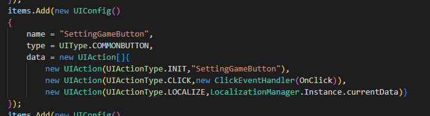

# 开始之前的准备
- 系统：Windows 10 21H2
- 游戏引擎：Unity 2021.3.1fc1(LTS)
- 代码编辑器：Visual Studio Code 

<!--more-->

# 游戏主界面
根据的 [设计文档](https://blog.79v2r.ml/2022/05/05/Infinity——游戏设计文档（2）/#游戏体验) 的说明，我们首先要搭建一个星空的背景，然后再创建一个 UI 界面，包括暂时包括开始游戏，结束游戏两个按钮。

## 星空背景
没有资源怎么办，上 Unity Asset Store 上白嫖啊（手动扇子笑）。在 [Asset Store](https://assetstore.unity.com) 上搜索 "star skybox"，然后随手选了一个 [Skybox Series Free | 2D 天空 | Unity Asset Store](https://assetstore.unity.com/packages/2d/textures-materials/sky/skybox-series-free-103633) ，添加到我的资源，在 Unity 中打开，下载导入一条龙。

接着创建新项目，点击 `窗口->渲染->光照` 打开光照面板，选择环境，将天空盒改为我们需要的材质，我这里选择了那个资源包里的 `6sidedCosmicCoolCloud` 的材质，第一眼感觉挺符合我的主题。


随后总感觉缺了点什么，是的，整个画面太静态了，我们让它动起来试试看，使画面效果呈现动态的效果，我有两个思路：
1. 使摄像机视角动起来
2. 在画面中添加动态元素

### 旋转摄像机
创建一个名为 `RotateSelf.cs` 的脚本文件，放于 `/Asset/Scripts/Utils` 文件夹下，在里面写一个旋转自己的功能，如下：
```C#
using UnityEngine;

namespace Infinity.Utils
{
    public class RotateSelfBySpeed : MonoBehaviour
    {
        public float speedAngle = 1f;        
        public Vector3 axis = Vector3.up;  
        // Update is called once per frame
        void Update()
        {
            gameObject.transform.Rotate(axis,Time.deltaTime*speedAngle);
        }
    }
}
```
- `speedAngle` 表示每秒旋转的角度，默认值为 `1` 。
- `axis` 表示绕着哪个轴旋转，默认是 `Vector3.up=(0,1,0)` ，也就是 Y 轴。

改完之后效果如下：


还有一种方式是摄像机不转，天空盒转，方法如下
```C#
RenderSettings.skybox.SetFloat("_Rotation",angle);
```
效果是一致的，因为我们开始界面里除了天空盒还会添加其他的东西，所以我选择第二种方式，并将脚本命名为 `RotateSkyBoxBySpeed` 挂载在主摄像机上 。

### 添加粒子特效
在场景中创建一个空对象 `Star` ，然后给它添加上一个 `Particle System` 组件，然后我们进行以下设置：
- 循环播放，让粒子系统循环发射粒子，`true`
- 预热，使其初始便存在粒子， `true` 
- 起始生命周期，我设置为 `3` 到 `5` 之间随机，代表其消失的时间在 3秒 到 5秒 之间随机
- 形状，`球体` ，半径 `200` ，半径厚度 `0` ，粒子会在半径 `200` 的球体的表面随机生成

同时因为天空盒在旋转，为了使粒子也转起来，我们将前面的 `RotateSelfBySpeed` 挂载到 `Star` 上，将速度设为 ~~一致~~ 相反数（可能是旋转方向的问题），使得星星（粒子）相对于天空盒不动。

如此便大功告成！

## UI 界面
在最开始的阶段，我们只需要创建两个按钮和一个 LOGO 便足以了。
### 创建 LOGO
只用一张图片来展示我的 LOGO 似乎并不是那么的酷炫，于是我准备用一个模型来作为 LOGO 展示在开始菜单页面上。建模苦手（根本不会）选择了 Windows 自带的 画图3D 来生成一个三维的字体模型，结果发现导出的两种格式 Unity 均不能识别，没办法只能通过一个在线转换模型的网站将其转为了 fbx 文件，才得以顺利识别。

导入进游戏后就成了这样


我们也给它加一点动态效果，比如，每个字母都能产生一定的浮动效果，显得不那么的单调。
所以我需要将每一个字母变成一个单独的模型，画图 3D 启动，全部导入 Unity 后，我们需要创建一个脚本 `SwingSelf.cs` 作用使自己模型进行一个随机的晃动。这里我采用了 [DOTween](https://assetstore.unity.com/packages/tools/animation/dotween-hotween-v2-27676) 插件来实现一些简单的动画效果
```C#
private void Start() {
	Tween tween = transform
		.DOShakePosition(time,strength,vibrato,randomness,snapping,fadeOut)
		.SetLoops(loops);
	tween = transform
			.DOShakeRotation(time,strengthAngle,vibrato,randomness,fadeOut)
			.SetLoops(loops);
}
```
给当前的物体加上了坐标晃动和旋转晃动，再利用脚本批量给所有字母挂上了这个脚本，随后再将光源做一个旋转，使其拥有一个动态的阴影效果。随后我打算再做一个 $\infty$ 的符号，最好是有一个表面流动的特效。

### 创建 $\infty$ 符号
利用插件 [Dreamteck Splines | 实用工具 工具 | Unity Asset Store](https://assetstore.unity.com/packages/tools/utilities/dreamteck-splines-61926) 创建了一条 $\infty$ 样式的曲线，然后利用其粒子系统，创建了一个沿着曲线发射的循环粒子系统，配合上透明发光材质效果还算不错（略微有一点点闪），步骤如下
1. 创建 3D 对象->Spline Computer.
2. 在 Scene 视图中依次勾勒出 $\infty$ 的曲线点。
3. 利用下图的两个按钮，将曲线移动到合适的位置，并进行适当的缩放。

4. 在该对象下新建一个 `效果->粒子系统` ，并在曲线上添加一个新组件 `Particle Controller` ，将新建的粒子系统对象赋值给该组件上的变量 

5. 将 `Emit point` 设为 `Beginning` ，`Motion Type` 设为 `Follow Forward` ，便可实现从曲线启点发射粒子沿着曲线终点的循环了。
6. 对粒子系统的参数进行调整，在此记录一下

| 名称         | 功能                                                      | 值             |
| ------------ | --------------------------------------------------------- | -------------- |
| 持续时间     | 设置粒子系统一次周期持续的时间                            | 10秒           |
| 循环播放     | 粒子系统周期结束后将开始新的周期                          | True           |
| 预热         | 提前进行循环使轨道中存在粒子                              | False          |
| 起始生命周期 | 粒子存在多少秒                                            | 15秒           |
| 起始速度     | 粒子初速度（被插件控制后无效，速度由曲线长/生命周期决定） | 1              |
| 起始大小     | 粒子初始大小                                              | 1              |
| 渲染器       | /                                                         | /              |
| 渲染方向     | 控制粒子渲染的方向                                        | /              |
| /            | 任何时候都对着摄像机                                      | Billboard      |
| /            | 拉伸粒子                                                  | 伸展 Billboard |
| /            | 粒子平行与地面（XOZ）                                     | 水平 Billboard |
| /            | 粒子平行与 XOY ，且面对摄像机                             | 垂直 Billboard |
| /            | 从网格中渲染粒子                                          | 网格           |
| 材质         | 选择粒子的材质                                            | Material       | 

7. 新建发光材质，`创建->材质` 命名为 `particle` 然后讲默认贴图赋给 `Base Map` ，`Surface Type` 设为 `Transparent` ，`Blending Mode` 设为 `Multyply` ，打开 `发射` 选择发光颜色，如此这边便创建好了一个发光材质，接下来将其托给之前粒子系统的 `渲染模块->材质` 即可。
8. 一个流动发光的 $\infty$ 便大功告成！

### 开始菜单
左边是我想要布置主菜单按钮的地方，这里我们需要接触到 Unity Graphic User Interface (UGUI) 系统，先在层级面板中创建一个 `UI->canvas` 这就是我们的画布了，所有的 UI 元素都要放在画布上面，随后创建一个空物体 `StartMenuPanel`  作为我们的 UI 面板，然后再在面板下面创建一个 `Button` ，如此便获得了一个最简单的开始按钮，但是我想将其变得酷炫一点，比如，加一点小小的特效，再让它从二维的 UI 变成三维的。
#### 条纹滚动特效
现将原本的贴图材质全部去掉，简单分析一下，我想要的画面有两层组成，一层是按钮的边框，一层是背后的条纹。因此我需要添加两个 `Image` 元素，并将其命名为 `Border` 和 `Background` 。
##### 边框
随手打开 ~~画图~~ [GIMP - GNU Image Manipulation Program](https://www.gimp.org/) （一个优秀的开源轻量版 PhotoShop ），画了一张只有边框，其余都是透明像素的图片


然后将 `Board` 的源图像设置成了它，需要注意，图像类型需选择切片，并设置好源图像的边框


如此会将原图像分为 9 个区域，切片模式的图片，会保持 1、2、3、4 四角区域不变，然后拉伸 5、6、7、8 四个区域的图片，9 则根据 `填充中心` 的选择与否进行填充。
 

调好颜色，我们便得到了一个带边框的按钮


##### 条纹
用工具画好后张这个样子


因为考虑到动态的效果，所以这次我们创建一个材质来处理它。如何将条纹随时间而动呢，这一点可以利用 Shader 来解决。
创建好的 Shader Graph 如下图：

简单的流程便是，将 Fragment 的 uv.x 随时间变化，然后讲条纹图片的导入格式里改为重复，便可以得到一张循环滚动的条纹图了，但是由于按钮是圆角的，所以矩形的滚动条纹会溢出边框，很不美观，所以我还用了一张遮罩图，最终得到一个圆角的滚动条纹材质，将其赋给 `Board` 的 `Image` 组件，便能看到效果。


#### 三维 UI 
将 `Canvas` 的 `渲染模式` 调成 `屏幕空间-摄像机`。此模式下，UI 将会由指定的摄像机渲染，并带有透视效果。因此只要将 UI 元素旋转一定的角度，便能实现三维 UI 的效果。

#### 交互效果
这实际上是一个按钮，当鼠标划过，点击时应该需要明显的反馈来告诉玩家我确实这么做了，所以我们将条纹滚动特效选中当鼠标悬停时生效，而点击特效可借由简单的缩放来实现。

##### 实现 IPointerEnterHandler 接口
此接口在指针进入 UI 时会发送给游戏物体，因此此时将动效打开即可。
```C#
public void OnPointerEnter(PointerEventData eventData)
{
	Hovering();
}

private void Hovering()
{
	transform.localScale = new Vector3(1.2f,1.2f,1.2f);
	Image image = background.GetComponent<Image>();
	image.enabled = true;
}
```

此处，还设置了悬停时，该 UI 元素缩放至 1.2 倍的效果。

##### 实现 IPointerExitHandler 接口
同样地实现 `IPointerExitHandler` 接口，该接口会在指针离开 UI 时被调用。
```C#
public void OnPointerExit(PointerEventData eventData)
{
	transform.localScale = Vector3.one;
	background.GetComponent<Image>().enabled = false;
}
```
将缩放还原，动效关闭。

##### 实现 IPointerDownHandler 接口
此接口会在指针按下时被调用，因此我们需要模拟一个按钮被按下的感觉
```C#
public void OnPointerDown(PointerEventData eventData)
{
	transform.localScale = new Vector3(1.1f,1.1f,1.1f);
}
```
因为悬停时缩放是 1.2 倍，我们按下时将其改为 1.1 倍。

*注意：这里的缩放用之前DOTween的缩放实现应该会更加平滑。*

##### 实现 IPointerClickHandler 接口
按钮最终的点击功能自然是要放到最后（不是），此接口会在指针在同一 UI 元素先 Down 再 Up 时被调用，我这里设计了一个事件，这样只要相应的逻辑注册了这个按钮的事件，在按钮被点击的时候就能执行回调。
```C#
public void OnPointerClick(PointerEventData eventData)
{
	OnClick?.Invoke(gameObject,new ClickEventArgs(eventData));
}
```
##### 展示


##### One More

- [ ] 如果要实现按钮的快捷键输入，目前的想法是在检测到 UI 被选中时，可以通过捕捉按键输入来实现，那么如何定义被选中，以及被选中时的逻辑，接下来可能会考虑。

#### 动态生成 & UI 框架
考虑到拓展性和 MOD 支持，动态生成 UI 还是非常有必要的。
这里思考一个框架，本作的 UI 元素主要是由以下几个组件组成
- UI 面板
- UI 图片
- UI 按钮
- UI 文本
- UI Toggle
- UI 下拉列表

考虑一下一些共有的特性，能否抽象出一个 UI Element 基类，或者一些接口。
如果到时候面临一个复杂多级的 UI ，如何保证让它正确的响应玩家的操作至关重要。因此我们需要确定一个焦点状态（或者说选中状态），确保只有当它处于焦点状态的时候才能响应操作，或者说一个优先级机制，优先响应高优先级的 UI ，感觉有点像 ~~操作系统的窗口~~ 。还有就是本地化和 Mod 的支持，如何为 MOD 作者创建一个易于搭建和拓展的 UI 也是需要思考的问题。先从做一个动态生成的开始菜单，方便别人和自己通过接口直接生成按钮开始。

##### 动态生成按钮
先寻找游戏的入口，开始界面是直接加载的场景，那么 UI 应该是从直接从 `StartMenuPanel` 的 `Awake` 开始，那么是直接由这个元素来生成按钮吗，虽然也可以，但总觉得有点怪怪的。因此还是创建一个 `UI Manager` 来管理，先写一个简单单例，暂时不考虑多线程，那就不加锁了。
```C#
public class UIManager : MonoBehaviour

    {

        public static UIManager Instance

        {

            get{

                if(_instance==null)

                _instance = new UIManager();

                return _instance;

            }

        }

  

        private static UIManager _instance;

  

    }
```

因为它也是一个 `MonoBehavior` 因此也存在生命周期，在 `Start` 的阶段，进行动态生成开始菜单。从本地加载预制体赋值。
```C#
//<your-path>为该资源相对于 Resources 的路径
GameObject prefab = (GameObject)Resources.Load("<your-path>");

StartMenuPanel = GameObject.Instantiate(prefab,canvas.transform);
```

随后我们需要一些信息来动态地生成一些同质化的 UI，将这些信息定义为一个类`UIConfig` 

`UIType` 为我们需要动态生成的预制体类型，目前只有一个 `BUTTON` ，`data` 则包括了一些额外的数据，供需使用。

生成一个列表，包含了需要动态创建的 UI 的一切信息，然后我考虑到未来动态增添按钮的情形，留下一个接口，这里用委托来实现
```C#
ModifyStartMenuPanelItems?.Invoke(new ModifyUIArgs(){items = items});
```
`ModifyStartMenuPanelItems` 是一个事件，我们只要订阅了这个事件，就能在此时修改 `items` 的内容，达到修改的目的，为了统一接口，我另外创建了一个 `ModInterface` 的类，用该类先订阅 `UIManager` 的事件，再将其广播出去的二层事件模型。

接下来便是动态生成 UI 的核心方法，考虑到动态的 UI 肯定会放进一个容器里，因此我们直接抽象出容器的接口，实现了容器的 UI 元素都能容纳 UI 并且动态排布。

如何处理 UI 数据呢，那么首先得思考一下有哪些数据， 最常见的 button ，有click 行为，然后我们要在这里，将回调方法绑定到 UI 上面，我们这里也采用事件来解决，即先用 `UIManager` 来订阅按钮的按钮事件，然后将按钮事件广播出去。

不同的组件可能有不同的行为，不同的行为可能有不同的数据，因此我们将其抽象为 `DynamicUI` ，实现了 `Regist` 方法，对不同的 `UIAction` 进行注册。

需要实现动态化加载 UI 的组件只需要继承其即可，同时定义了几个 `UIAction` 用来定义行为。`CLICK` 说明该 UI 需要绑定回调，`LOCALIZE` 说明该 UI 需要显示本地化字符。 

并且相应地抽象出几个接口，用于调用，`IClickable` 

`ILocalizable`

IContainer

回过头来，之前动态生成 `StartMenuPanel` 的完整方法也变为了


按钮的 `OnClick` 会调用 `UIManager` 的 `OnClick` 从而向所有订阅了事件 `UIManager.clickEvent` 的对象发送消息。

基本的一个框架搭起来了，剩下的就是将 `IContainer` 和 `ILocalizable` 接口实例化到对象，完成动态调整位置和改变文本的工作。

完成之后，试一下效果，再加一个按钮。



效果达到预期。


