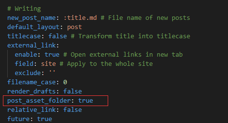
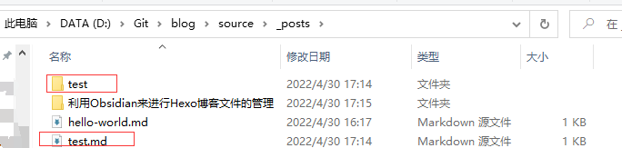
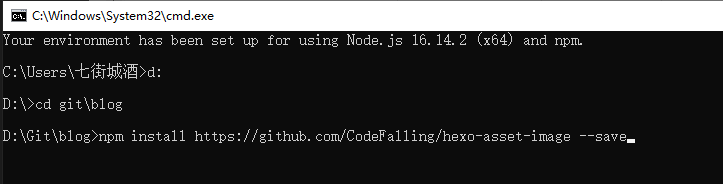
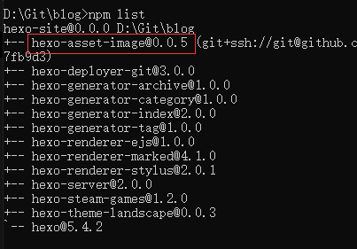
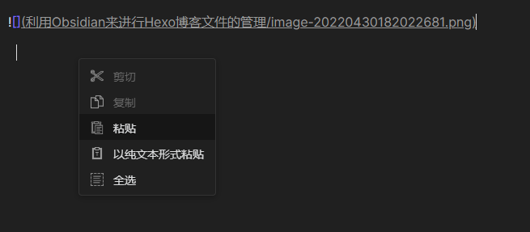
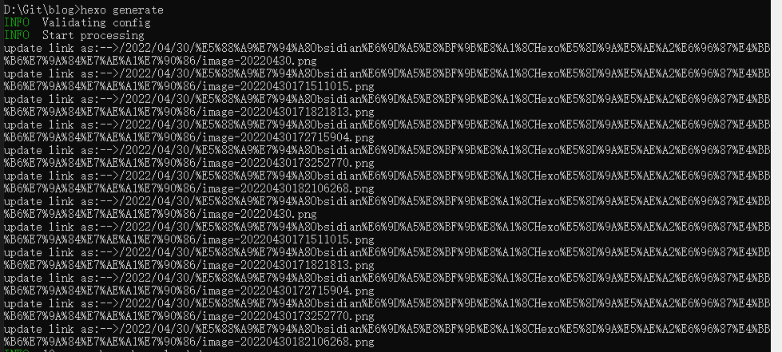
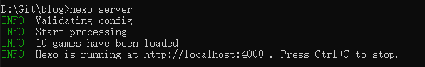
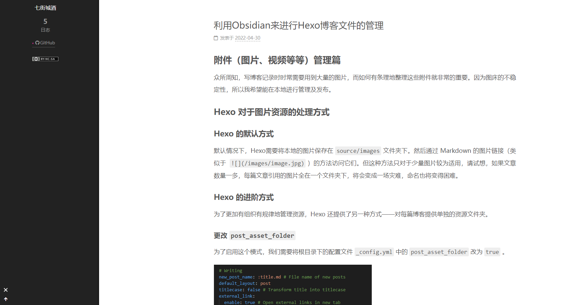
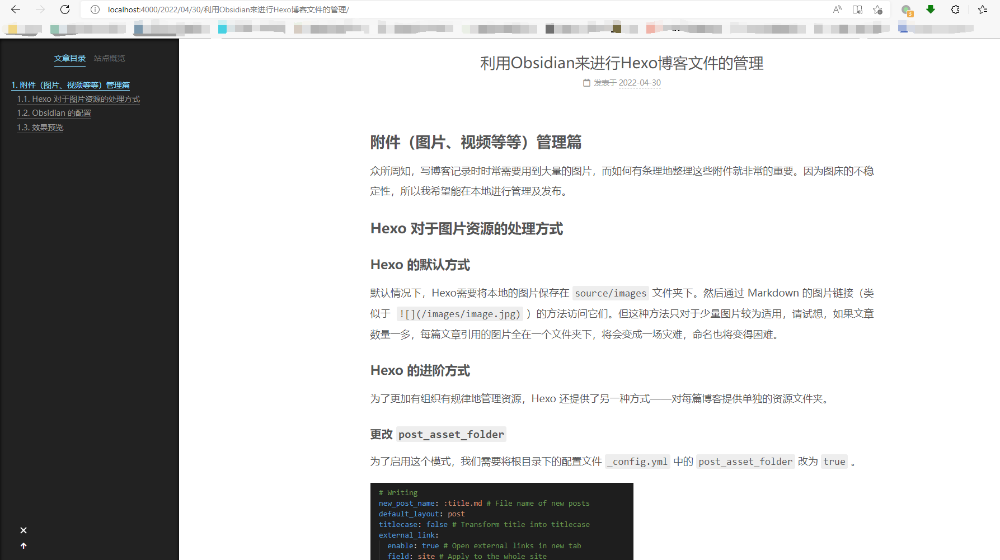

# 附件（图片、视频等等）管理篇  
众所周知，写博客记录时时常需要用到大量的图片，而如何有条理地整理这些附件就非常的重要。因为图床的不稳定性，所以我希望能在本地进行管理及发布。
## Hexo 对于图片资源的处理方式
### Hexo 的默认方式

默认情况下，Hexo需要将本地的图片保存在 `source/images` 文件夹下。然后通过 Markdown 的图片链接（类似于  `` ）的方法访问它们。但这种方法只对于少量图片较为适用，请试想，如果文章数量一多，每篇文章引用的图片全在一个文件夹下，将会变成一场灾难，命名也将变得困难。
<!--more-->

### Hexo 的进阶方式

为了更加有组织有规律地管理资源，Hexo 还提供了另一种方式——对每篇博客提供单独的资源文件夹。

#### 更改 `post_asset_folder` 

为了启用这个模式，我们需要将根目录下的配置文件 `_config.yml` 中的 `post_asset_folder` 改为 `true` 。

 

如此之后，在使用 `hexo new [layout] <title>` 命令创建新文章时，便会自动在相应的 `layout` 文件夹下创建一个名为 `<title>` 的文件夹，作为此文章的资源文件夹


随后可以看到在 `source/_posts` 文件夹下，Hexo 还新建了 `test` 文件夹



#### 安装 `hexo-asset-image` 插件

除此之外，***还需要安装*** `hexo-asset-image` ***插件***，否则之后在与 Obsidian 配合的过程中会出现问题。在 `Node.js command prompt` 命令行先进入Hexo目录，随后键入以下命令，安装插件。

```bash
npm install https://github.com/CodeFalling/hexo-asset-image --save
```



安装完成后，Hexo的配置便告一段落，可以通过`list`命令来查看是否安装成功。

```bash
npm list
```



## Obsidian 的配置
### Obsidian 的默认功能
Obsidian 可以直接通过在文章中粘贴图片来导入图片并且自动生成符合格式的 Markdown 的链接，并且可以在设置中的 `文件与链接` 通过更改 `新附件的默认位置` 来选择相应的位置。
有以下几个选项：

- 库的根目录
- 下方指定的文件夹
- 当前打开的文件所在的文件夹
- 当前文件夹下指定的子文件夹

我们理应选择的是最后一项 ***当前文件夹下指定的子文件夹*** ，但到目前版本（v0.14.6）为止，Obsidian 还只支持选择固定文件名的子文件夹，如推荐命名为 `Attachments` 或者 `Assets` ，但Hexo 之前创建的文件夹是动态名称的，其与文章标题一致，因此我们需要借助插件的力量。

### 安装 `Custom Attachment Location` 插件

在安装插件之前，还需要将 `设置->第三方插件->安全模式` 设置成关闭，方可启用社区插件。然后点击 `社区插件` 搜索 `custom attachment location` 安装即可，如果因为网络问题无法安装可以到 [项目网站：RainCat1998/obsidian-custom-attachment-location: Customize attachment location with variables($filename, $data, etc) like typora. (github.com)](https://github.com/RainCat1998/obsidian-custom-attachment-location) 手动进行安装

> ### Manual Install
>
> -   Download `main.js`, `manifest.json` in the [latest release](https://github.com/RainCat1998/obsidian-custom-attachment-location-plugin/releases/latest).
> -   Copy `main.js`, `manifest.json` to your vault `VaultFolder/.obsidian/plugins/obsidian-custom-attachment-location/`.
> -   Enable plugin in Obsidian setting.

这里也给出一份镜像包 [main.js](利用Obsidian来进行Hexo博客文件的管理/main.js) 、[manifest.json](利用Obsidian来进行Hexo博客文件的管理/manifest.json) 。

安装完成后选择启用，然后进入 `插件选项->Custom Attachment Location` 将 `Location for New Attachments` 改为 `./${filename}` 

***注意：`设置->文件与链接->使用Wiki链接` 应关闭，否则粘贴图片时生成的不是 Markdown 标准的链接***

此时，我们往 Obsidian 中粘贴图片时，便会将图片保存在 Hexo 生成的文件夹下，且生成的链接格式为 `` 



此时，再运行 `generate` 命令生成静态页面时，便会自动地将此链接更新成网页中的完整路径

```bash
hexo generate
```

***注意：需安装  `hexo-asset-image` 插件，安装方法见[安装 hexo-asset-image 插件](#安装-hexo-asset-image-插件) ，否则将不会更新链接导致图片位置错误，因为 Hexo 在生成页面时会将资源文件放进和页面文件同路径下。***



## 效果预览

运行 `server` 命令在本地服务器上查看

```bash
hexo server
```



打开浏览器，输入`http://localhost:4000` 查看效果。可以看到，此时无论是主页上的图片还是文章内的图片都是正常显示的，避免了通常情况下主页的图片显示问题。





>通过常规的 markdown 语法和相对路径来引用图片和其它资源可能会导致它们在存档页或者主页上显示不正确。在Hexo 2时代，社区创建了很多插件来解决这个问题。
>
>——[资源文件夹 | Hexo](https://hexo.io/zh-cn/docs/asset-folders)


# 同步篇
