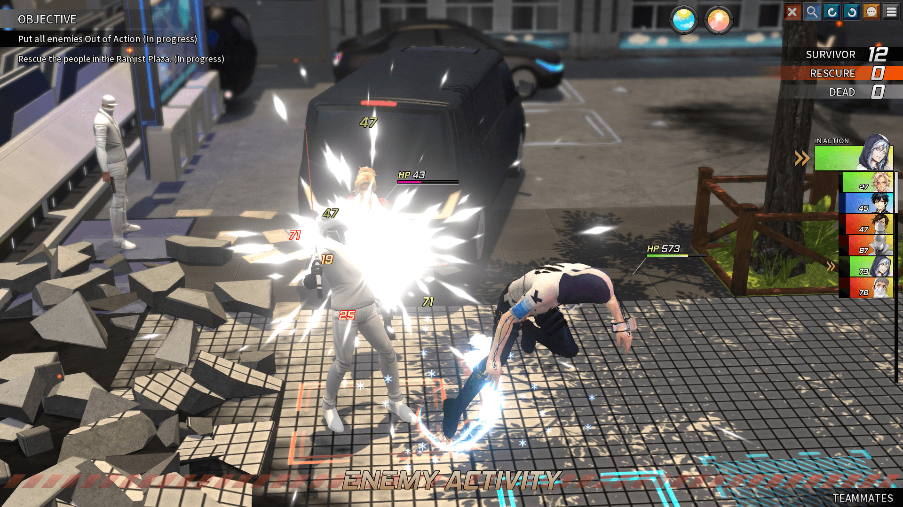

前段时间玩了一个游戏叫[***TROUBLESHOOTER: Abandoned Children（中文名：纷争终结者: 被遗弃的孩子们）***](https://store.steampowered.com/app/470310/_/) 。由一个韩国小工作室开发，体量并不算很大，但就游戏效果来说，已经足够合格了，且与未来想要制作的游戏具有众多可取之处，以本文记录之。

简单地总结地说，这是一款二次元的XCOM2（虽然本人也是先玩了本作再去体验了XCOM2手动滑稽），但刚上手体验XCOM2的时候，确实能感受到战斗系统的相似性（~~不能说一模一样只能说完全一致~~）

# 游戏截图

<!--more-->

# 战斗系统
## 关卡设计
### 地图
总的来说，本作的关卡是由一个又一个互不联系的场景组成。而每个场景则是由全3D模型构建的，与一般3D游戏不同的是，可以明显地看出模型的排布是按照格子的，整个游戏世界也是网格化的，举个通俗的例子 *Minecraft* 便是一个典型，模型都可以放进类似 `1*1*1` 或者 `2*1*1`
的空间内，然后像搭积木般便可构建出自己的地图。

这样做的好处有很多：
- 对于非大型团队来说，统一规格的模型处理起来要方便的多，地图构建也容易的多
- 对于一个策略游戏来说，战旗游戏走格子应该是非常容易接受的一件事
- 对于玩家来说网格化的地图会非常有条理，且容易操作
- 从编程角度来考虑，如此设计也有利于编码的实现

因此我决定沿用这种方式，来尽快地构建出我的游戏。

### 音乐
这实在不是我的强项（~~听个响就好~~），略去不表，当前目标：能做到 ***风格主题与剧情相统一就是胜利*** 。

### 敌人
从关卡设计的角度来看敌人设计的话，敌人设计或许更可以看做难度设计。在一个大背景是养成因素的游戏中，到底是 ***动态难度***（指关卡的难度会随着养成的进度而发生变化），还是 ***固定难度*** ，对游戏开发者来说是一个非常困难的抉择，前者会让玩家心生怨气，”养成都养到了敌人身上“，如此言论在采用动态难度的游戏的论坛版块里并不少见；后者则会显得平平淡淡，不够生动，真实性和游戏性总是会产生冲突，而如何平衡则是每一个游戏制作者需要思考的。

>有一类隐藏机制相比之下更加多样化且普遍——调整游戏难度和平衡的机制。这些机制被总称为动态难度调节（dynamic difficulty adjustment,下文简称DDA）。
>
>DDA是电子游戏根据玩家水平调整游戏难度的过程。若玩家表现优秀，游戏将加大难度和挑战。相反，若玩家打得很吃力，游戏可能会降低难度帮玩家度过难关。
>
>DDA分为短期和长期两种。短期DDA与游戏的随机数生成器挂钩，目的是为了防止玩家遇到极端情况，一直幸运或一直倒霉。这些随机系统在某些时刻对游戏进行平衡，一般不会对游戏进程造成长远影响。
>
>而长期DDA是根据玩家的水平调整游戏的整体难度。由于每位玩家的技能水平不同，统一的难度等级或选项无法覆盖所有玩家的需求。长期DDA的目标是使游戏对每位玩家来说既具有挑战性，又可克服。
> 
> —— [More Than Meets the Eye: The Secrets of Dynamic Difficulty Adjustment (gamedeveloper.com)](https://www.gamedeveloper.com/design/more-than-meets-the-eye-the-secrets-of-dynamic-difficulty-adjustment)

本作的敌人设置或者说难度曲线整体比较平稳，有时战斗会出现额外的BUFF会有惊喜感，却又不像*侠隐阁*那般频繁，以至于让人厌恶~~（苦修三年，还是什么都改变不了，全程看BUFF）~~。

#### 关于难度曲线的一些思考
对于一个传统策略RPG来说，评价玩家的实力我们可以将它简单的建个模，玩家实力 $P$ 与以下几个参数相关，策略 $S$ ，玩家数据 $D$ (包括等级，装备，技能等常见的纸面实力)，那么可以这样建模，因为一个好的策略可以发挥出数倍的纸面实力。
$$
P = S * D
$$
当玩家卡关时，即 $P<E$ （ $E$ 为敌人实力），玩家可以选择增强自己的 $S$ 或者是 $D$ 来使自己的 $P>E$  从而过关，所以对于动态难度而言，如果使$$E\propto D$$ 便会让因卡关而“刷级”（提升自己的等级、装备）的玩家有之前那番的体验，从而产生很强的挫败感。

>”养成都养到了敌人身上“

所以我个人倾向于动态难度应该使 $$E\propto S$$可是如果这样，那不是努力提升 $S$ 的玩家同样会感到挫败感，~~所以我觉得最好的方法就是不要动态难度~~，可实际上由于策略的提升不像数据那么的明显，并且拥有滞后性（这是因为 $S$ 的评估不像 $D$ 可以直接通过当前的数据计算得出，它通常是对战后数据的统计进行一个评价，从而得出玩家战斗策略的好坏），所以在过关之前，怪物的难度并不会发生变化而影响到玩家的“士气”。

#### 如何评价玩家策略好坏
同时，因为战后数据 $A\propto (D-E)$ ,即在策略不变的情况下，玩家实力越强于怪物实力，战后数据也理应更加好看，所以在评估 $S$ 时，应该撇去$D-E$ 对 $A$ 的影响。已知在 $D>>E$ 时，$S$ 对 $A$ 几乎没有影响，但在 $D\approx E$ 时，$S$ 对 $A$ 影响巨大，而且$D<<E$ 时，$S$ 对 $A$ 也几乎没有影响。不妨设
$$
S\in[0,100],A\in[0,100],\delta=\frac{D-E}{D+E}\in(-1,1)
$$
其中 $\delta$ 代表的是敌我相对实力，$\delta\to1$ 代表我方无限强于对方, $\delta\to-1$ 代表敌方无限强于我方。

令
$$
B=50+50\*ln_2(1+\delta)(\delta>0)
$$
$$
B=50-50\*ln_2(1-\delta) (\delta<0)
$$
为基准战损数据，比较实际战损数据 $A$ 与基准战损数据 $B$ ,

若 $B>50$则
$$
S=50+(A-B)*\frac{50}{100-B}
$$
若 $B<50$ 则
$$
S=50+(A-B)*\frac{50}{B}
$$
#### 举例计算
举个例子，假设当时的 $\delta=\frac{1}{3}$,即 $D=2E$ ,可得基准分数$B=50+50*ln_2(\frac{4}{3})\approx71$ ，所以当 $A>71$ 时，高于基准分数的部分，将以 $\frac{50}{29}$ 的权重，转化为高于基准策略 $50$ 部分的策略评价。
当 $A>2B-100=42$ 时，
$$
S=50+(A-B)*\frac{50}{100-B}=50+(A-71)*\frac{50}{29}=1.724A-72.4
$$
 $A<42$ 时，
 $$
 S=0
$$
用人话说，这个算法其实就是先根据敌我实力确定一个基准的战损数据，又令刚好达到这个战损时的策略分数为 $50$ ，即不优不劣。再根据实际战损与基准战损的差值，确定实际策略的分数。若$B>50$ 则就是将 $[B,100]$ 的战损数据与 $[50,100]$ 的策略分数对应了起来，用图表示即为:

## 战斗机制
本作采用的是经典回合制战斗，***CTB(Conditional Turn-based Battle)*** 系统，通俗地讲，当前回合的行动与角色的回合速度决定了距离下一回合的时间。举个简单的例子，基础回合间隔为$100$ ，你当前的行动增加了回合间隔 $50$ ，而你的回合速度为 $10$ ，那么距你下次出手的实际间隔便是 $(100+50)/10=15$ ，某种意义上来说*太吾绘卷*也是CTB系统，在前面加个前缀$A(Automatic)$或者更加准确，因为从战斗开始，角色就一直在自动进行普攻和移动的循环。

>#### CTB的特点
>- 回合速度越快，出手间隔越短，甚至可以达到多次出手（标准回合制中，速度只决定出手顺序）
>- ***(核心)玩家行动对回合速度产生影响***，增强了策略性但平衡将变得更加困难

玩家的行动包括进行攻击，使用物品，与环境互动三种。
### 攻击
本作攻击按来源可分为两种，来自技能的攻击，与来自物品的攻击，其中前者占了大头。

### 技能
技能又分为三种
- 普攻技能，通常没有冷却时间，威力也偏低，可以移动攻击，反击和追击的默认技能。
- 通常技能，一般有2-3个回合的冷却，威力适中，一般也可以移动攻击，不可反击和追击。
- 终极技能，一般4-5个回合的冷却，威力巨大，但只有当怒气值满了才可以使用。

最明显的感觉就是主动技能过少，且带有明显倾向性，一个角色不到10个主动技能，只能携带大约一半，且两种职业的技能侧重存在差异，致使玩家选择一个方向后的技能选择几乎是固定的，虽然本作的重点在于模块搭配，但主动技能的缺乏，仍然让人感觉到束手束脚。

### 物品
消耗品装备后提供一定次数的使用机会，好评，对于仓鼠症的玩家来说，有效的提高了道具的使用几率。但总体来说，特殊道具偏少，存在感较低，基本主动道具上只有提供治疗的作用，和很少的buff，一些被动道具的特殊效果还算不错，但直到后期才会获得，意义不是很高。

### 地形互动
本作除了源自XCOM2的掩体机制，几乎没有别的地形互动，好像只有一个烟雾/毒雾地形，还有油箱爆炸，存在感不强，甚是可惜。

### 问题
- 在大量敌人存在的时候，过回合将变得极其缓慢，似乎很多回合制游戏都有这样的通病，~~侠隐阁第二年第三年最终战打得我想当场去世~~，以至于想要快速通关的唯一方法就是”TheWorld“（在我的回合内将敌人杀光就好了）目前的优化思路有：
	1. 加快敌人的过回合速度，如动画速度，移动速度，省略动画效果，镜头移动速度
	2. 将过回合的方式由线性改为并行（真的可以做到吗），因为从逻辑上，敌人的行动策略是根据上一个人物的行动结果制定的，所以理论上不可行，除非游戏将逻辑和动画完全分离，先把逻辑层的回合全部跑完，再合并动画展示。
	3. 减少需要同时过回合的敌人数量 ，略去范围外敌人的行动。
- 高地不存在射程的加成，以至于狙击手这个职业处于一个非常尴尬的局面，（好不容易爬到一个高地，两回合干完了附近所有的敌人，又得马不停蹄的赶往下一个地方）本作的遭遇战过多而攻坚防守战太少，体验不佳。

